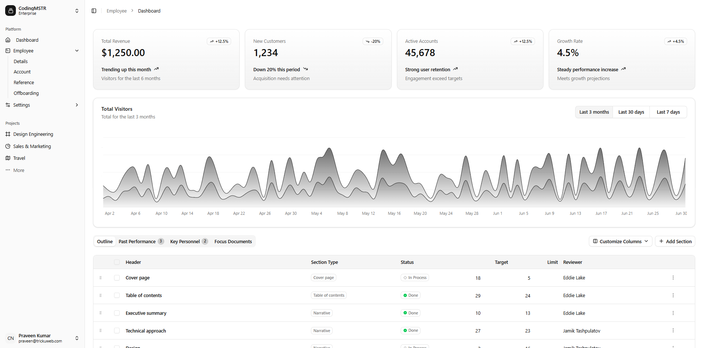
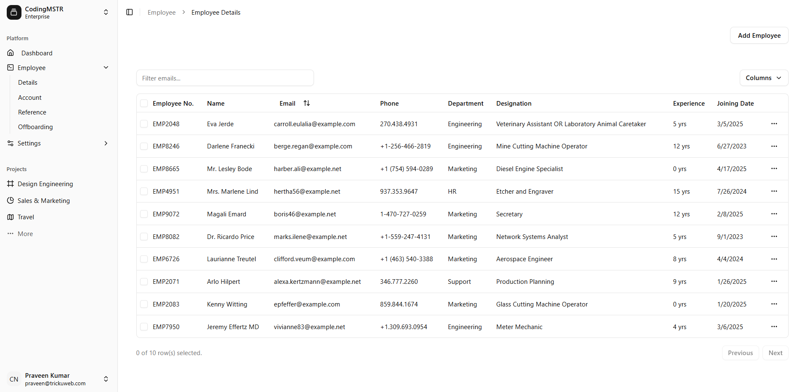
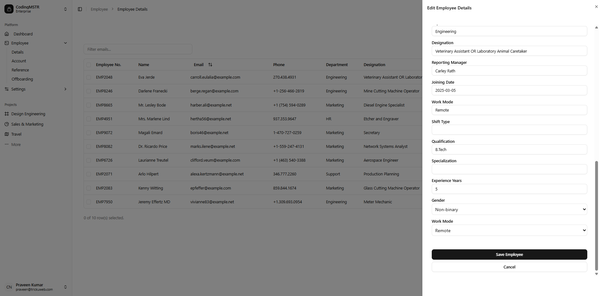
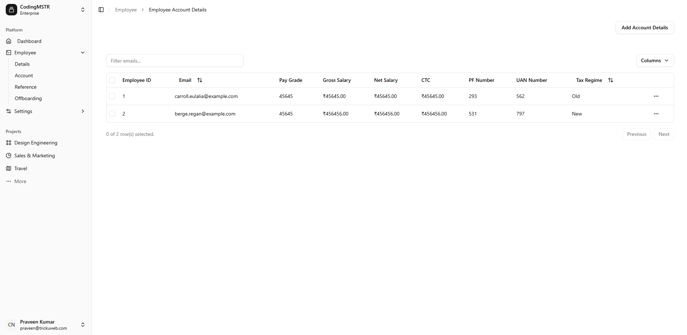

# 👩‍💼 Employee Management System

A modern web application for managing employee records, built with **React JS** (frontend), **Shadcn UI** (UI framework), **Laravel** (backend), and **MySQL** (database).

## 📸 Screenshots

| Dashboard | Employee List |
|----------|----------------|
|  |  |

| Add Employee | Account View |
|--------------|---------------|
|  |  |

> Ensure the `screenshots/` folder is in the root directory when viewing this on GitHub.

---

## 🛠 Tech Stack

- **Frontend:** React JS, Shadcn UI, Tailwind CSS
- **Backend:** Laravel 10+
- **Database:** MySQL
- **API Communication:** RESTful APIs with Axios or Fetch

---

## ✨ Features

- 🔐 User authentication (Login/Register)
- 🧑‍💼 Add, update, delete employee records
- 📄 View detailed employee profiles
- 🔍 Search and filter employees
- 📊 Dashboard with employee stats
- 🌐 Responsive UI (Desktop & Mobile)

---

## 🚀 Getting Started

### Prerequisites

- Node.js (v16+)
- Composer
- PHP (v8.1+)
- MySQL
- Laravel CLI
- npm or yarn

---

## ⚙️ Installation

### 1. Clone the Repository

```bash
git clone https://github.com/ipraveenkmr/Employee-Management-System.git
cd employee-management-system

2. Setup Backend (Laravel)
cd backend
cp .env.example .env
composer install
php artisan key:generate

# Create database in MySQL then update .env accordingly


php artisan migrate
php artisan serve

3. Setup Frontend (React + Shadcn UI)
cd frontend
npm install
npm run dev


employee-management-system/
├── backend/             # Laravel backend
│   └── ...
├── frontend/            # React JS frontend
│   └── ...
├── screenshots/         # UI Screenshots
├── README.md
